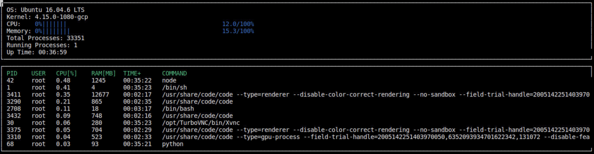

# System-Monitor

In this project, I program a custom Linux system monitor with C++ that shows the system and processes information.

## Make

This project uses [Make](https://www.gnu.org/software/make/). The Makefile has four targets:

* `build` compiles the source code and generates an executable
* `format` applies [ClangFormat](https://clang.llvm.org/docs/ClangFormat.html) to style the source code
* `debug` compiles the source code and generates an executable, including debugging symbols
* `clean` deletes the `build/` directory, including all of the build artifacts

## Instructions

1. Clone the project repository:

    `git clone https://github.com/aeternalis-ingenium/system-monitor.git`

2. Build the project

    `make build`

3. Run the resulting executable:

    `./build/monitor`

## Reference

This project is a part of ["Udacity Nanodegree C++ Developer"](https://www.udacity.com/course/c-plus-plus-nanodegree--nd213).
